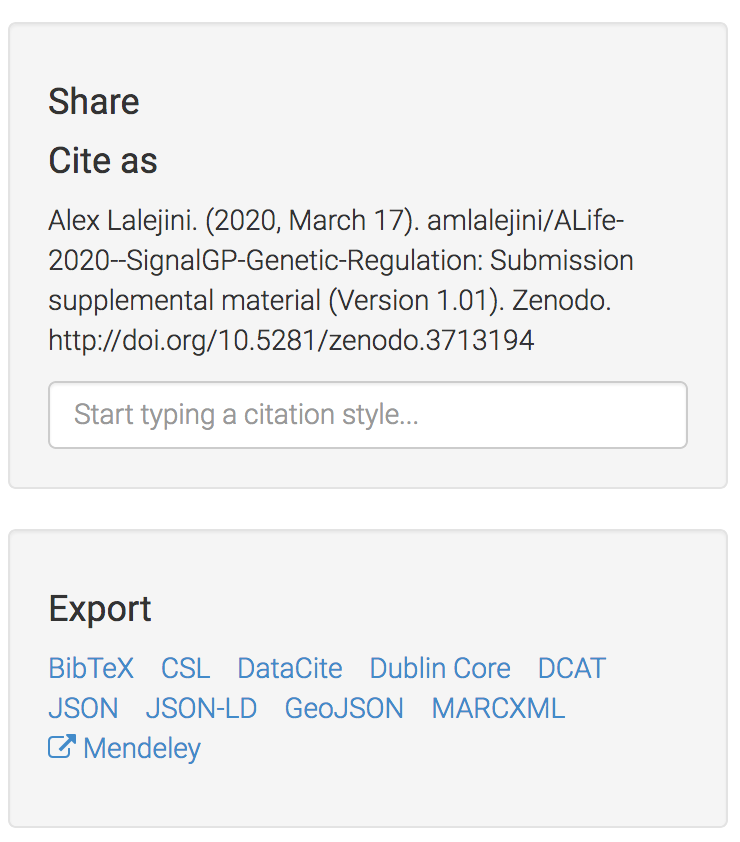
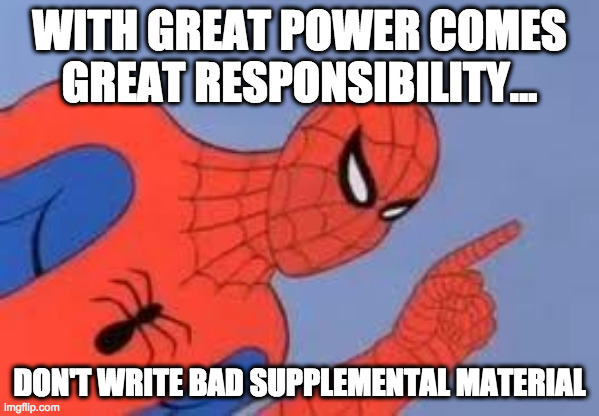

## How I include supplemental material for any publication

Adding supplemental material to any paper is as easy as:

1. making a GitHub repository packed with supplemental goodness
2. using Zenodo to assign your repository a cite-able DOI
3. citing your DOI-minted repository in your article
4. minimal effort bonus: use GitHub pages to turn your supplemental material into a website

<!-- 👉skip directly to guide  -->

An academic publication's supplemental material is that ill-defined thing you throw all of the extra
content that you couldn't fit into your original submission. E.g., extra analyses, dope videos, all
of your raw data files, source code, *et cetera*.
For computational researchers, including (or pointing to) the source code used to conduct our experiments
is a critical step toward ensuring reproducibility.

During my tenure as a graduate student, I've learned that through the combined powers of public GitHub
repositories and Zenodo, I can include as much supplemental material as I'd like with any publication,
regardless of the publication's venue.
In fact, _any_ academic publication that leans on software for experiments and/or
data analyses has no excuse for not having quality supplemental material.
The practices of copy-and-pasting source code into PDFs (yes, this is a real thing that I have
encountered) must end!

### Why spend time writing supplemental material?

Supplemental material is an opportunity for you to present all of those many exploratory experiments,
analyses, and visualizations that didn't make it into your submission. This gives you a chance
to shout 'hey, look at all this work that went into the making of this submission'. In a time where
[academia is biased against negative results](https://doi.org/10.1007/s11192-011-0494-7), supplemental material also affords a platform
for communicating the mountain of exploratory and negative results that a paper's final results are
built atop.

Perhaps most importantly, supplemental material assists your methods section in helping others to
reproduce and extend your work.
You can include all of your (hopefully commented) source code and provide step-by-step guides to compiling
and running your experiments in a level of detail that the space alloted to a methods section cannot
accommodate, which can dramatically lower the barrier for others (or future you) to reproduce your work.

### How to have supplemental material for anything

I use two services to make my supplemental material happen:

- [GitHub](https://github.com/)
- [Zenodo](https://zenodo.org/)

You'll need an account on both services (accounts are free, so no worries there).

#### Setup a GitHub repository to house your supplemental material

I typically manage all of my projects start-to-finish using GitHub. Version control is a wonderful thing,
especially for collaborations.

There's a huge community that uses GitHub, so it's not hard to google
for solid tutorials. I find [https://guides.github.com/](https://guides.github.com/) plus their
[youtube channel](https://www.youtube.com/githubguides) to be useful.

#### Make your GitHub repository citable

I'll outsource this step to GitHub's very nice guide for making your repository citable:
[https://guides.github.com/activities/citable-code/](https://guides.github.com/activities/citable-code/).

#### Cite your repository

Zenodo makes this part easy. Just navigate to the Zenodo's record page for your repository and look
for the 'Cite as' box, or even more conveniently, the Export links to download the citation in your
preferred format.

Add the reference to your paper's reference list and cite away!

Make sure the actual DOI for your repository appears in your reference; otherwise, it may be hard for
anyone interested to actually find your repository.

#### Bonus: make your supplemental material web-accessible

I'm a big advocate for using GitHub pages to generate and host static websites with absolutely minimal
effort (and at no cost).
Making a website for a repository is actually as easy as toggling a switch in your repository's settings.
Pro-tip: this is also a fantastic way to create and maintain personal web-sites (e.g., http://mmore500.com/,
https://lalejini.com/).

Again, I'll outsource the how-to to one of GitHub's own guides:
[https://guides.github.com/features/pages/](https://guides.github.com/features/pages/).

Under the hood, GitHub uses [Jekyll](https://jekyllrb.com/) to turn your repository's content into a
static site.
You can go as wild or as tame as you'd like on the website generated.

Once GitHub pages if flipped on, can do things like...

- Convert your data analyses into nice, annotated HTML pages that you can link folks to
  - I do the vast majority of my data and statistical analyses using R. Using [R markdown](https://rmarkdown.rstudio.com/articles_intro.html)
    it's easy for me to embed my analyses in a markdown document, which can be compiled into a nifty
    HTML page.
    - E.g., [source file](https://github.com/amlalejini/ALife-2020--SignalGP-Genetic-Regulation/blob/master/experiments/alife-2020/analysis/repeated-signal-task-analysis.Rmd),
      [resulting html file](https://lalejini.com/ALife-2020--SignalGP-Genetic-Regulation/experiments/alife-2020/analysis/repeated-signal-task-analysis.html)
  - Conversions from other common data analysis setups (e.g., Jupyter notebooks) are also not difficult,
    just google around for how to convert your analysis setup of choice.
- You can also write cool JavaScript (or C++ compiled into JavaScript via [Emscripten](https://emscripten.org/))
  web applications and embed them into your now web-accessible supplemental material.
  - E.g., fitness landscape visualizations by Emily Dolson: [https://emilydolson.github.io/fitness_landscape_visualizations/](https://emilydolson.github.io/fitness_landscape_visualizations/)

### Writing good supplemental material

Bad supplemental material doesn't go far in improving your work's reproducibility  (e.g., code copy
and pasted into pdfs). If source code is incomprehensible or gentle guidance on how
to re-run an experiment is not given, no one (including future you) is likely to spend the requisite
time to resuscitate the experiments.

Lesson: just tossing code and analysis scripts into a citable GitHub repository does not make for good
supplemental material.

Here are a few things that I aspire to do to improve the quality of my supplemental material:

- Provide a brief overview of the project (motivations, experiments, findings).
  - Pictures, pictures, pictures! Use all of those useful cartoons/graphics you had to cut from your
    paper!
- Add a step-by-step guide to re-running your experiments
  - List all of your external dependencies, and if possible, link to the exact commit of any other repositories
    someone needs to download to run your code.
  - If you want to check the quality of your guide, you can follow it yourself on a fresh virtual
    machine.
- Provide a brief organizational guide for your repository
  - Where is your experiment code? Where are your analysis scripts? _et cetera_
  - I've recently taken to writing README files for most directories in the repository (which is rendered
    on GitHub when someone clicks into the directory).

If you've done a cool thing with your supplemental material or have experiences to share, let us know!
